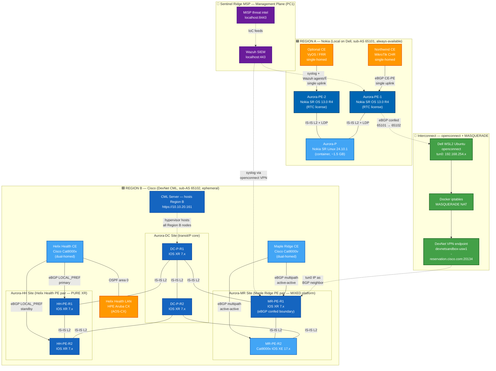

# ADR-002 — Two-region Aurora carrier (Nokia local + Cisco-dominant DevNet CML)

| Field | Value |
| --- | --- |
| Status | Accepted |
| Version | 1.0 |
| Date | May 2026 |
| Supersedes | ADR-001 v1.6 single-region MSP carrier decision |
| Triggered by | Empirical DevNet integration validation per ADR-001 §17.6 (May 31 2026) |
| Decision | Aurora carrier deployed across two regions — Nokia region locally on home lab, Cisco-dominant region in Cisco DevNet CML — interconnected at the region boundary via openconnect-in-WSL2 + Docker MASQUERADE + eBGP |
| Owner | Lab architecture (Elvis Ifeanyi Nwosu) |
| Related | `docs/lab-architecture.md` (ADR-001 v1.6), `docs/design.md`, `docs/ip-plan.md`, `BACKLOG.md` |

## Revision history

| Version | Date | Change |
| --- | --- | --- |
| 1.0 | May 2026 | Initial — full pivot from ADR-001 single-region to two-region carrier with DevNet CML hosting the Cisco-dominant region. Architectural decision driven by May 31 2026 empirical validation that openconnect-in-WSL2 + containerlab + Docker MASQUERADE provides clean L3+L7 reach into DevNet sandbox environments. Includes refined topology per user direction same evening: Region A all-Nokia hybrid (SR Linux P + 2× SR OS PEs, single-homed CEs accepting tier-2 single-PE-failure tolerance); Region B dual-router-per-site (Aurora-DC P pair both XR, Aurora-MR PE pair mixed XR + XE reflecting gradual modernisation, Aurora-HH PE pair pure XR for regulated-industry audit consistency) with dual-homed CEs (Maple Ridge active-active multipath, Helix Health active-standby LOCAL_PREF). Topology diagram in §3.3a updated with per-site subgraphs and platform colour coding. |

## 1. Context

ADR-001 (v1.0 through v1.6) designed Aurora Communications as a single-region MSP carrier hosted entirely on local hardware. The vendor strategy was Cisco-first with HPE Networking (Aruba + Juniper post-merger) as the second-vendor demonstrator and a single Nokia PE for SP-side multi-vendor interop. The active-lab pool on PC1 was constrained to 6 GB at peak — tight enough that demos required workload cycling (Cowork closure, Docker Desktop closure) per ADR-001 §10 constraints.

On May 31 2026, an empirical DevNet integration diagnostic (ADR-001 §17.6) confirmed that:

- `openconnect` installed inside Ubuntu WSL2 establishes `tun0` in the WSL2 routing namespace
- Docker's default MASQUERADE rules transparently NAT containerlab containers' source addresses to the WSL2 host's tun0 IP
- DevNet sandbox devices reply normally; container-to-DevNet reachability is verified at L3 and L7 (HTTPS to embedded CML returned HTTP 200)
- The Cisco SD-WAN sandbox's embedded CML server at `10.10.20.161` is accessible to the local lab via this path and gives operator-controlled topology hosting

This validation enables a fundamentally better architecture: instead of cramping the full multi-vendor carrier into the local Dell's 14 GB Aurora workload pool, the **Cisco-dominant portion of the backbone runs in Cisco-hosted infrastructure (free via DevNet)** while the **Nokia portion remains local** as the resource-light operational anchor.

This mirrors how real Australian regional and national carriers structure their backbones — Telstra, Optus, NBN Co, and TPG all operate multi-region, multi-vendor backbones where regional choices are driven by historic vendor relationships, cost, and operational specialisation rather than monoculture.

## 2. Hardware envelope (unchanged from ADR-001)

PC1 (Ryzen 7 2700, 32 GB), Dell (i5-6300U, 32 GB), Surface Pro (8 GB) — per ADR-001 §2. The pivot does not change hardware. It changes workload placement.

## 3. Two-region architectural model

### 3.1 Region A — Nokia (Local)

Aurora's Nokia-flavoured region, hosted entirely on local hardware. **All-Nokia stack** with single-homed CEs accepting that single-PE-failure tolerance is the appropriate level for this region's customers.

| Role | Implementation | RAM | Notes |
| --- | --- | --- | --- |
| Aurora-P | **Nokia SR Linux 24.10.1** | ~1-1.5 GB | Container-native data plane. Pulled from `ghcr.io/nokia/srlinux` per ADR-001 §15.5. Fast boot, lightweight, runs the IGP and label distribution backbone. |
| Aurora-PE-1 | **Nokia SR OS 13.0 R4** (TiMOS, on-disk demo license per ADR-001 §10 #12) | ~2-3 GB | Primary PE — classic SR OS carrier OS for tenant VPRN and BGP peering |
| Aurora-PE-2 | **Nokia SR OS 13.0 R4** | ~2-3 GB | Secondary PE — RTC-frozen license shared with PE-1. Same platform for operator-skill consistency. |
| Customer-edge devices | Single-homed per tenant (mixed vendors) | ~500 MB-1 GB each | See per-tenant table below |

**Customer-edge devices in Region A** (single-homed to designated PE):

| Tenant CE | CE platform | Connected to | PE-CE protocol |
| --- | --- | --- | --- |
| Northwind CE | MikroTik CHR 6.41.4 | Aurora-PE-1 (single uplink) | eBGP CE-PE |
| Optional spare CE | VyOS or FRR | Aurora-PE-2 (single uplink) | OSPF CE-PE |

**Region A total RAM**: ~6-7 GB on Dell with all nodes active. Fits comfortably within the 14 GB Aurora workload pool with margin for tenant endpoint VMs.

**Why hybrid SR Linux + SR OS rather than pure SR OS**:
- SR Linux's design heritage is data-centre fabric and modern programmability — its role as a P-router in Region A demonstrates Nokia's modern fabric NOS handling SP transit duty.
- SR OS classic CLI on both PEs preserves the senior-Nokia-operator skill demonstration (`A:R1>config>router>bgp#` hierarchical CLI, VPRN service architecture, MD-CLI fallback).
- ~1 GB saved by using SR Linux for P versus a third SR OS instance.

**Tenants served from Region A**:
- Northwind Robotics (CE = MikroTik CHR, fits the "modern tech company" persona; single-homed because Northwind accepts the single-PE-failure risk in exchange for lower carrier cost)
- Spare capacity for any tenant when Region B (DevNet) is unavailable due to maintenance or reservation queue
- Operational sandbox for protocol experimentation without DevNet reservation dependency

**Single-homing rationale**: Region A is the resource-constrained tier. Single-homed CEs are an explicit architectural choice — not a deficiency — reflecting how smaller regions in real carriers accept single-PE-failure tolerance in exchange for lower operational complexity. This is the kind of regional asymmetry that real SP design accepts based on customer revenue and SLA tier.

### 3.2 Region B — Cisco-dominant (DevNet CML hosted)

Aurora's larger, Cisco-dominant region, hosted in the CML server embedded in a Cisco DevNet Reservation sandbox. **Dual-router per site** at every backbone tier (P core, all PE sites) and **dual-homed CEs** for tenants. Tier-1 production design discipline applied throughout.

#### 3.2.1 Three sites, six backbone routers

| Site | Router-1 | Router-2 | Why this platform mix |
| --- | --- | --- | --- |
| **Aurora-DC** (transit / P core) | **DC-P-R1**: Cisco IOS XR 7.x | **DC-P-R2**: Cisco IOS XR 7.x | P core requires consistent IOS XR for MPLS LDP/SR-MPLS, IS-IS L2 transit, RSVP-TE, and carrier-grade label switching. Both routers IOS XR for operational consistency at the core. |
| **Aurora-MR** (Maple Ridge PE site) | **MR-PE-R1**: Cisco IOS XR 7.x | **MR-PE-R2**: Cisco Cat8000v IOS XE 17.x | Mixed XR + XE PE site demonstrates the platform diversity real SP carriers carry. Maple Ridge as a general SME accepts whatever PE platform is present at the local site — operators gradually modernise the PE fleet site-by-site over years. |
| **Aurora-HH** (Helix Health PE site) | **HH-PE-R1**: Cisco IOS XR 7.x | **HH-PE-R2**: Cisco IOS XR 7.x | Pure XR PE pair. Regulated industry — operational simplicity for audit and change-management requires platform consistency. Helix Health (healthcare) cannot tolerate the cognitive overhead of mixed platforms at their dedicated PE site. |

#### 3.2.2 Customer edges (dual-homed per tenant)

Each customer CE connects to BOTH PE routers at its local PE site via eBGP. The PE pair runs as a redundant pair with the CE choosing primary path via LOCAL_PREF or splitting via multipath.

| Customer | CE platform | Uplinks (dual-homed) | PE-CE protocol | Active path selection |
| --- | --- | --- | --- | --- |
| Maple Ridge | **Cisco Cat8000v** | MR-PE-R1 (XR) AND MR-PE-R2 (XE) | eBGP CE-PE with multipath | BGP `multipath` for active-active load balancing (Maple Ridge values throughput, accepts asymmetric path) |
| Helix Health | **Cisco Cat8000v** | HH-PE-R1 (XR) AND HH-PE-R2 (XR) | eBGP CE-PE with LOCAL_PREF | LOCAL_PREF higher on R1; R2 standby (Helix Health values predictable path for compliance — active-standby is auditable) |
| Helix LAN | HPE Aruba CX (AOS-CX) | Helix Health CE (single connection to LAN) | OSPF area 0 between CE and LAN | n/a |

#### 3.2.3 Where Cisco SD-WAN fits

Region B's design above is **the classic MPLS L3VPN architecture** — Cisco IOS XR + IOS XE running BGP/IS-IS/MPLS. Per ADR-001 v1.6 §17.6 findings, Cisco SD-WAN sandboxes use OMP rather than traditional BGP, so SD-WAN is NOT used as the underlying transport in Aurora's Cisco region.

If a future demand surfaces a "modern overlay WAN" demonstration scenario, the SD-WAN 20.x sandbox can be brought up as an **adjacent** demo — but Aurora's Region B core remains classic MPLS L3VPN. This is the right architectural choice for a carrier providing transit-based services (Aurora's stated business model).

#### 3.2.4 Region B node inventory summary

| Tier | Node count | Platform mix |
| --- | --- | --- |
| Aurora-DC P pair | 2 | 2× IOS XR |
| Aurora-MR PE pair | 2 | 1× IOS XR + 1× Cat8000v IOS XE |
| Aurora-HH PE pair | 2 | 2× IOS XR |
| Maple Ridge CE | 1 | 1× Cat8000v |
| Helix Health CE | 1 | 1× Cat8000v |
| Helix LAN switch | 1 | 1× HPE Aruba CX |
| **Total** | **9 nodes** | 5× IOS XR + 3× Cat8000v IOS XE + 1× Aruba CX |

CML Personal handles 20 nodes — 11 nodes of headroom for growth (additional CEs, route reflectors, traffic generators, lab nodes for protocol tests).

**Region B is ephemeral**: it exists only during an active DevNet sandbox reservation. The topology, configuration, and saved state are reconstructed from version-controlled CML topology YAML files on each fresh reservation.

**Tenants served from Region B**:
- Maple Ridge Logistics (Cisco SME — dual-homed via Cat8000v CE to mixed-platform PE pair MR-PE-R1 XR + MR-PE-R2 XE)
- Helix Health Analytics (regulated industry — dual-homed via Cat8000v CE to pure-XR PE pair HH-PE-R1 + HH-PE-R2; HPE Aruba LAN behind CE)
- Larger branches and DC sites for any tenant that benefits from current production-version Cisco code with carrier-grade redundancy

### 3.3a Topology overview



**Legend:**
- 🟦 Dark blue = Nokia SR OS (classic CLI, RTC-frozen license, carrier PEs)
- 🔵 Mid blue = Nokia SR Linux (container, modern data plane, P role)
- 🟦 Dark blue = Cisco IOS XR (current 7.x, carrier P and PE roles)
- 🔵 Mid blue = Cisco IOS XE (Cat8000v 17.x, PE alternative and CE roles)
- 🟧 Orange = Multi-vendor CEs and LAN devices (MikroTik, VyOS, Aruba)
- 🟩 Green = Interconnect tier (openconnect, MASQUERADE, VPN endpoint)
- 🟣 Purple = Sentinel Ridge MSP management plane
- ─── Solid line = data-plane link in topology
- ┄┄┄ Dashed line = control-plane / management / overlay relationship

**Topology summary:**

1. **Region A — Nokia hybrid stack, single-homed customers** (~6 GB total RAM): SR Linux at the P role for lightweight data-plane transit, two SR OS PEs for classic carrier service termination. Customer CEs single-homed reflecting the resource-constrained tier-2 reality.
2. **Region B — Cisco dual-router per site, dual-homed customers** (9 nodes in CML): Aurora-DC P pair (2× IOS XR), Aurora-MR PE pair (mixed XR + XE — gradual modernisation pattern), Aurora-HH PE pair (pure XR — regulated industry consistency). Maple Ridge CE active-active multipath; Helix Health CE active-standby LOCAL_PREF (audit-friendly path selection).
3. **eBGP confederation across the region boundary** — Nokia PE-1 (sub-AS 65101) peers with MR-PE-R1 (sub-AS 65102) over the openconnect VPN. External peers see Aurora as a consolidated AS 65100 carrier.
4. **Asymmetric resilience by design** — Region A accepts single-PE-failure tolerance for lower operational cost; Region B implements production-grade dual-router-per-site discipline. This is realistic SP regional asymmetry, not a deficiency.

### 3.3 Interconnect — the region boundary

Region A and Region B are connected at L3 over the openconnect VPN tunnel:

```
Region A (Local, Dell containerlab)
  ↕  WSL2 host tun0 (via Dell or PC1, decision in §6)
  ↕  openconnect VPN
  ↕  DevNet sandbox internal network 10.10.20.0/24
Region B (CML, embedded in DevNet sandbox)
```

The L3 path uses Docker MASQUERADE — Region A's Nokia PE sends BGP packets to Region B's Cisco PE; the source IP is rewritten to the WSL2 host's tun0 address; the Cisco PE configures its BGP neighbor as that tun0 address. **eBGP between AS 65100 (Region A Nokia) and AS 65100 (Region B Cisco — same logical Aurora carrier, but different region BGP confederations)** OR **iBGP across the region boundary if Aurora is modelled as a single AS with multiple regions**.

**Initial choice for ADR-002 v1.0**: model both regions as **AS 65100 with two BGP confederations** (`65101` for Region A Nokia, `65102` for Region B Cisco-dominant). Confederation BGP keeps the external presentation as a single AS while permitting regional autonomy in route propagation.

Alternative: single iBGP mesh with route reflectors per region. Simpler but less realistic for a multi-region carrier.

## 4. Vendor strategy per region

### Region A — Nokia (Local)

- **Backbone**: Nokia SR OS classic CLI for PEs, FRR for P or backup PE
- **Customer-edge**: Mixed vendors with MikroTik dominant (Northwind persona); some FRR/VyOS for "open-source-friendly" customers
- **Demonstration purpose**: Multi-vendor SP-side interop, classic Nokia operator skill, resource-light "always available" lab

### Region B — Cisco (DevNet CML)

- **Backbone**: Cisco IOS XR 7.x on P and PE; Cat8000v IOS XE 17.x as additional PE platform
- **Customer-edge**: Cisco Cat8000v dominant for "Cisco SME" customers (Maple Ridge); mixed with HPE Aruba CX for "regulated industry" customers (Helix Health) where DevNet hosts that flavour
- **Demonstration purpose**: Current production Cisco code, Cisco-dominant SP architecture, scale demonstrations beyond local hardware ceiling

This is faithful to how real AU carriers structure themselves. The vendor-per-region pattern is what an interviewer expects to see in a senior SP design.

## 5. Operational model

### 5.1 Day-to-day lab operations

| Scenario | What's running |
| --- | --- |
| **Region A always-on (default)** | Nokia SR OS + FRR + Nokia-region tenants on Dell. ~5 GB RAM. Available 24/7. |
| **Region B on-demand** | Reserve DevNet sandbox (SD-WAN 20.12 or equivalent with embedded CML). Deploy CML topology via REST API call from local Ansible. ~10-15 min provisioning. Available for the reservation window (4 hr to 7 days). |
| **Two-region cross-demos** | Both A and B active; openconnect from local WSL2 to DevNet; eBGP across the region boundary. For interview demos. |
| **Single-region demos** | Either region in isolation (Region A always available; Region B requires reservation). |

### 5.2 Reproducibility

Region B's existence in DevNet is ephemeral, but the **topology and config are version-controlled** in the Aurora repo:

```
aurora-comms/
├── docs/
│   ├── adr-002-two-region.md          # this ADR
│   └── lab-architecture.md            # ADR-001 v1.6 (historic)
├── region-a-nokia/
│   ├── clab-region-a.yml              # containerlab topology
│   ├── configs/                       # FRR + SR OS configs
│   └── ansible/                       # Local-region playbooks
├── region-b-cisco-cml/
│   ├── cml-topology.yml               # CML lab definition (REST API payload)
│   ├── configs/                       # IOS XR + Cat8000v configs
│   └── ansible/                       # Region B playbooks targeting DevNet IPs
└── interconnect/
    ├── frr-asbr-config.j2             # Nokia-side BGP config template
    ├── iosxr-asbr-config.j2           # Cisco-side BGP config template
    └── README.md                      # Manual + automated bring-up procedure
```

A fresh DevNet reservation + Region B redeploy takes ~30-45 minutes from reservation click to converged eBGP session.

### 5.3 Reservation discipline

| When Region B needed | Action |
| --- | --- |
| Interview demos | Reserve sandbox ~30 min before call; ensure VPN up, CML topology deployed, BGP converged |
| Customer-facing demos | Reserve 4-hour slot with 1-hour buffer; have rollback ready |
| Async development (no demo pressure) | Reserve up to 7-day slot; use the long window for protocol experimentation |
| Always-available access | Region B is intentionally NOT always-available; this is a documented constraint, not a deficiency |

## 6. Where VPN terminates — Dell or PC1?

The WSL2 host running `openconnect` becomes the "DevNet edge" of Region A. Two choices:

| Choice | Implications |
| --- | --- |
| **VPN on Dell WSL2** | Dell already hosts Region A's containerlab. Region A → DevNet path is local, fastest. PC1 reaches DevNet via Dell (or via its own separate openconnect). |
| **VPN on PC1 WSL2** | PC1 has Wazuh + MISP + Cowork already. Adds VPN as another always-on burden. Region A on Dell would need to route via PC1 over the GRE/tailnet path to reach DevNet — adds latency and complexity. |

**Decision for ADR-002 v1.0**: VPN runs on **Dell** because Dell hosts Region A's backbone and the region-boundary BGP needs the shortest path. PC1 retains its existing role (Wazuh + MISP + Cowork + tenant endpoint VMs).

## 7. What's deprecated from ADR-001 v1.6

| ADR-001 plan | Status in ADR-002 |
| --- | --- |
| §6 RAM allocation showing carrier monolith on Dell | **Superseded** — Dell now hosts only Region A (~5 GB) |
| §14 single multi-vendor topology per tenant | **Refined** — tenants are assigned to a specific region; multi-vendor diversity is per-region rather than per-tenant |
| §15.4 throughput-test topology pattern | **Still applies** for Region A; Region B inherits CML's hosting throughput |
| §17 DevNet as "external inter-AS peer carrier" | **Replaced** — DevNet is now hosting the *Cisco region of Aurora itself*, not an external carrier |
| Sprint W4 vrnetlab wrappers for Cat8000v, Cat9000v, ASAv | **Deprioritised** — Region B uses DevNet CML's licensed images; local vrnetlab wrappers for these are no longer required |
| vr-xrv 6.1.3 wrapper from on-disk | **Deprioritised** — DevNet CML provides current XR 7.x; on-disk 6.1.3 retained as offline fallback only |
| vr-vios L3 wrapper from on-disk | **Deprioritised** — DevNet CML provides current IOS XE 17.x; on-disk 15.7 retained as offline fallback only |

## 8. What's retained from ADR-001 v1.6

| Item | Status |
| --- | --- |
| Option C hybrid workload distribution (Wazuh + MISP on PC1, lightweight services on Dell) | Retained |
| Tailscale overlay between PC1, Dell, Surface Pro | Retained |
| Docker daemon split on PC1 (Desktop for personal, native for lab) | Retained |
| WSL2 `.wslconfig` 12 GB memory cap on PC1 | Retained |
| Nokia SR OS RTC trick for 2015 license validity | Retained — required for Region A's Nokia PE |
| `openconnect`-in-WSL2 as canonical DevNet VPN pattern (ADR-001 §17.7) | Retained AND elevated to Region B's only access path |
| Per-tenant CE/LAN diversity (ADR-001 §14) | Retained, now scoped per region |
| Three-tenant taxonomy (Maple Ridge, Helix Health, Northwind) | Retained, with tenant-to-region mapping per §3 |

## 9. Constraints accepted

These explicit limitations are accepted as part of the ADR-002 decision:

1. **Region B is ephemeral.** It exists only during active DevNet reservations. Outside reservation windows, Region B is unreachable. The lab must be fully demonstrable from Region A alone (Nokia-only) for any moment when DevNet is unavailable.
2. **Region B state is reset per reservation.** No persistent state survives between reservations. The cml-topology.yml + Ansible playbooks are the source of truth; they reconstruct Region B from scratch on each fresh reservation.
3. **VPN bandwidth from Australia to Cisco US-West is 150-250 ms latency.** Acceptable for CLI work and demos but slow for GUI screen-shares of CML web UI under heavy interaction.
4. **DevNet sandbox availability is not guaranteed.** Reservation slots may be unavailable during high-demand windows. Region B demos must have a fallback plan (use the embedded CML in a different sandbox type, or postpone).
5. **eBGP across the openconnect tunnel relies on Docker MASQUERADE.** Source IP from Region A's BGP-speaking node is rewritten to the WSL2 host's tun0 address. Region B's BGP neighbor config must use that tun0 IP — which may rotate per VPN session if Cisco's pool assigns differently. Operationally, capture tun0 IP at session start and template the Region B neighbor config from it.
6. **Authentication and routing protocol auth across regions** is on the W4+ backlog. Initial eBGP for ADR-002 v1.0 uses plain TCP-179 without MD5/TCP-AO. Authentication added once base architecture is stable.

## 10. Migration plan (ADR-001 v1.6 → ADR-002 v1.0)

### Phase 1 — Document the pivot (this ADR)

Commit `docs/adr-002-two-region.md` to repo. Reference from `docs/lab-architecture.md` (ADR-001 v1.6) header as "Superseded by ADR-002".

### Phase 2 — Region A local infrastructure (Sunday evening)

Priority vrnetlab wrappers, building only what Region A actually needs:

- `vr-sros` — Nokia SR OS 13.0 R4 with RTC patch (HIGH — required for Nokia PE)
- `vr-vios-l2` — Cisco IOSv-L2 (HIGH — LAN switching has no DevNet substitute for "always-available" tenants in Region A)
- `vr-routeros` — MikroTik CHR (HIGH — Northwind CE)
- `vr-csr` — Cisco CSR1000v 16.8 (MEDIUM — offline fallback for Cisco CE when DevNet unavailable)

Skip from ADR-001 v1.6 marathon:
- `vr-vios` (IOS XE L3) — DevNet CML provides newer
- `vr-xrv` (IOS XR 6.1.3) — DevNet CML provides current 7.x

### Phase 3 — Region B CML topology design (Sunday late / Monday morning)

Author `region-b-cisco-cml/cml-topology.yml` — a CML lab definition that, when uploaded via CML REST API, creates:

- 2× Cisco IOS XR 7.x (one P, one PE)
- 1× Cisco Cat8000v IOS XE 17.x (alternative PE)
- 2× Cisco Cat8000v (cEdges for two tenants)
- 1× HPE Aruba CX (Helix Health LAN, if hosted in this CML)
- Internal links + 1× external connector for management plane

Author corresponding Ansible playbook `region-b-cisco-cml/ansible/deploy.yml` that:

1. Detects an active DevNet reservation
2. Authenticates to CML at `https://10.10.20.161/api/v0/`
3. Uploads the lab topology
4. Starts all nodes
5. Applies per-node configs from `region-b-cisco-cml/configs/`

### Phase 4 — Interconnect (Monday morning)

Configure eBGP between Region A's Nokia SR OS PE and Region B's Cisco IOS XR PE. Validate session reaches Established. Validate route exchange.

### Phase 5 — Demo rehearsal (Monday afternoon)

Practice the two-region demo as a screen-share narrative. Key talking points:
- Architecture decision driven by empirical validation
- Region split mirrors real AU carriers
- ADR-002 supersedes ADR-001 with documented reasoning
- Reproducibility via topology-as-code

## 11. Operational runbook (preview)

Full runbook lives in `docs/runbook.md` post-implementation. Preview of the operational shapes:

### Daily — Region A only
```
# Already running. Just verify.
cd ~/aurora-comms/region-a-nokia
containerlab inspect -t clab-region-a.yml
```

### On-demand — Region B reservation + topology deploy
```
# 1. Reserve DevNet sandbox (manual via DevNet portal)
# 2. Capture VPN credentials
# 3. Connect openconnect in Dell WSL2
sudo openconnect --user=<dev-username> <vpn-endpoint>

# 4. Capture tun0 IP for region-boundary BGP
ip -br -4 addr show tun0

# 5. Deploy Region B via Ansible
cd ~/aurora-comms/region-b-cisco-cml
ansible-playbook ansible/deploy.yml -e tun0_ip=<captured-ip>
```

### Two-region cross-validate
```
# From Region A Nokia PE
ssh admin@nokia-pe-1 'show router bgp summary'
# Verify Region B Cisco PE shows as Established

# From Region B Cisco PE (via DevNet CML console)
show ip bgp summary
# Verify Region A Nokia PE shows as Established
```

### Teardown — end of demo
```
# Tear down Region B (free DevNet slot)
End reservation via DevNet portal

# Region A stays running (daily operational state)
```

## 12. Interview narrative

After ADR-002 ships, the interview story becomes:

> "I designed Aurora as a single-region MSP carrier in ADR-001. On May 31 2026 I empirically validated DevNet sandbox integration via openconnect-in-WSL2 — containers reach DevNet IPs at L3 and L7 transparently via Docker MASQUERADE. That validation surfaced a better architecture: a two-region carrier with Nokia at one region locally and Cisco-dominant at the other region in DevNet CML. I committed ADR-002 the same evening, deprecated five planned vrnetlab wrappers from the old plan because DevNet CML provides current production-version equivalents, and rebuilt the marathon priorities to focus on what Region A actually needs. The architecture mirrors how real AU carriers like Telstra structure themselves — multi-region, multi-vendor, with regional vendor specialisation. ADR-002 is the canonical design now; ADR-001 stays in repo as historic record of the decision path."

That demonstrates:
- Empirical engineering reasoning
- Willingness to deprecate prior work when better evidence arrives
- Documentation rigor (ADRs, not just changes)
- Realistic carrier design knowledge
- Operational maturity (ephemeral cloud resources used appropriately)

## 13. Risks and mitigations

| Risk | Mitigation |
| --- | --- |
| DevNet sandbox unavailable when demo needed | Demo Region A only; mention Region B as part of architecture intent |
| eBGP across openconnect tunnel fails to establish | Fall back to single-region Aurora; document the finding |
| MASQUERADE source IP changes per VPN session | Capture tun0 IP at session start; template Region B BGP neighbor from it via Ansible |
| CML API quirks in this specific DevNet sandbox | Build Region B manually via CML web UI first; automate later |
| Time pressure before Monday's interview | Path A (document intent + essential builds tonight, full implementation Tuesday) was rejected; Path B requires disciplined execution |

## 14. References

- `docs/lab-architecture.md` — ADR-001 v1.6 (historic, superseded)
- `docs/design.md` — protocol-level Aurora design (still applies, scoped per region)
- `docs/ip-plan.md` — IP and AS plan (will be amended with confederation IDs)
- `BACKLOG.md` — sprint plan, will be updated to reflect Region A vs Region B work
- DevNet Cisco SD-WAN 20.12 sandbox documentation (per-reservation)
- `hellt/vrnetlab` — vrnetlab wrappers for Region A's local image inventory
